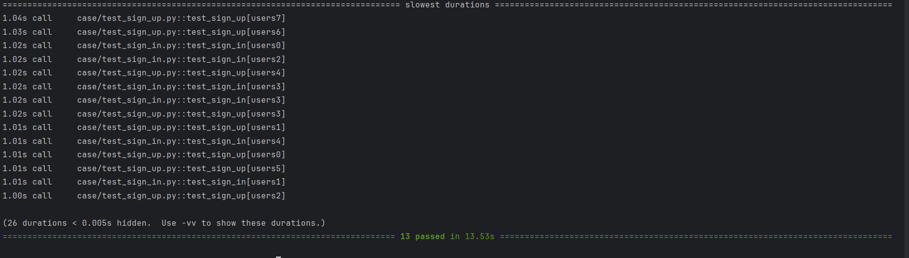
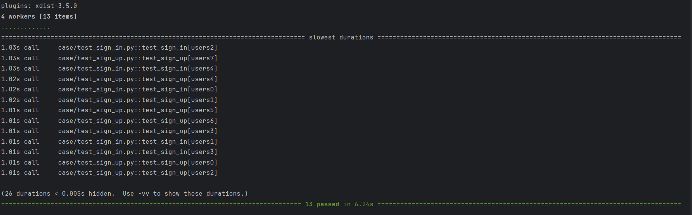

    <h3 align="center">接口自动化多进程执行 demo</h3>

#### 1. 结构
- `server.py`: flask app，包含登录和注册两个接口，用于测试
- `api`: 存放 yaml 文件，yaml 文件包含接口 url 和用于参数化的数据
- `case`: 测试用例目录
- `fake_db`: 存放用于模拟数据表的 yaml 文件，其中 `user_db.yaml` 保存的是已注册的用户数据
- `middleware`: 工具类的函数，例如读取 yaml 文件，构造 json 类型的响应数据

#### 2. 多进程执行用例
使用 `pytest-xdist` 插件

#### 3. 效率对比

环境设置: 为了直观的看到多进程执行用例的效果，因此让每条用例执行前都等待 1 s

- 非多进程执行: `pytest -s --durations=0`，13 条用例平均需要 13s 左右

- 多进程执行: `pytest -s --durations=0 -n=auto`，13 条用例平均需要 6s 左右
